# LedgerLens — Bank Statement Analyzer (Credit Risk Lens) · Proof of Concept

[](https://github.com/bhawnamanglapm/LedgerLens1/actions/workflows/test.yml)

LedgerLens ingests raw bank statements (digital PDF, scanned PDF, images, Excel, CSV, text), extracts every transaction, classifies it, validates the data and produces a structured credit-risk summary: a 0–1000 score, a rating band and a decision recommendation.

It comes in three forms that share **one engine** (`app/engine.js`):

| | Hosted page (claude.ai link) | Local app (`npm start`) | Command line |
|---|---|---|---|
| What | Interactive UI: upload, pipeline, transactions, review queue, risk summary, activity log, taxonomy, "Why an LLM?" | Same UI served by a small backend | Same pipeline, writes the JSON output |
| AI step | **Rules only** (no backend can run there) | **LLM (Claude)** for batch extraction and unclear-row classification, rules as cross-check and fallback | `--llm` flag |
| Runs | In the browser | Browser + Node 18 backend on your machine | Node 18 |

---

## 1. Setup

### Hosted page
Open the LedgerLens link (shared separately). Nothing to install. The AI step shows **Rules only** because a hosted page cannot hold an API key.

### Local app with the LLM (recommended for the review)
Quickest: run `./setup.sh` (Windows: `setup.ps1`) — it checks Node, installs, creates `app/.env` and runs the tests. Or by hand:
```bash
cd app
npm install                                  # pdfjs-dist, tesseract.js, English OCR model, xlsx
cp .env.example .env                         # then paste your Claude API key into .env
npm start                                    # → http://localhost:8787
```
**API key:** create one in the Claude Console (platform.claude.com → Settings → API keys); it is shown once and starts with `sk-ant-`. Keep it only in `app/.env` (ignored by git, never zipped) or in the `ANTHROPIC_API_KEY` environment variable — never in code, the browser, screenshots or the demo recording. Optional in `.env`: `LLM_MODEL` (default `claude-sonnet-5-5`), `PORT`.
Open http://localhost:8787 → Ingest → **AI step: LLM (Claude)** is selected automatically when the key is set → upload a statement. Without a key the app still runs (rules only) and says so.

### Command line
```bash
cd app
node cli.js ../test-statements/02_multi_month_multi_account.pdf -o out.json          # rules only
node cli.js ../test-statements/02_multi_month_multi_account.pdf --llm -o out.json    # with Claude (needs ANTHROPIC_API_KEY)
node cli.js ../test-statements/03b_scanned_statement.pdf -o out.json                 # scanned PDF: needs poppler (pdftoppm)
node cli.js locked.pdf --password <pw> -o out.json
node cli.js --sample flags            # built-in samples: flags | clean | jumbled
node cli.js statement.pdf --taxonomy taxonomy-example.csv -o out.json   # custom categories (override / extend)
node cli.js a.pdf b.pdf c.png         # several files / accounts in one upload
```
Exit codes: `0` success · `2` password needed or wrong · `3` pipeline stopped by validation (e.g. jumbled pages) · `4` `--llm` without a key.

### Tests
```bash
cd app && npm test        # 68 checks, offline, ~1 min — no API key needed
```
GitHub Actions runs the same tests on every push (`.github/workflows/test.yml`).

### Sharing a cloud link
Only if reviewers ask: `Dockerfile` + `render.yaml`, with a password, a demo banner and model-call limits. Step-by-step in **`DEPLOY.md`**.

---

## 2. Architecture

```mermaid
flowchart LR
  A[Upload<br/>PDF · scan · PNG/JPG · XLSX · CSV · TXT] --> B[1 Convert<br/>pdf.js text layer · OCR for scans · Excel→CSV]
  B --> C[2 Validate page order<br/>Page X of Y per file · date continuity · missing pages]
  C --> D[3 Batch extraction<br/>LLM call per 3 pages · rule parser cross-check<br/>header metadata · inheritance]
  D --> E[Data cleaning<br/>duplicates · bad dates · bad amounts]
  E --> F[4 Enrich<br/>counterparty · channel · attributes · aliases · IFSC→bank]
  F --> G[5 Classify<br/>RULE → LLM call for leftovers → MANUAL]
  G --> H[Smart review<br/>high-impact items only · grouped]
  H --> I[6 Score<br/>6 components → 0–1000 · band · decision]
  I --> J[22 data validation checks]
  J --> K[JSON export · UI · Activity log]
  D -. /api/llm .-> L[(Backend server.js<br/>holds API key)]
  G -. /api/llm .-> L
  L -. tool use, temperature 0 .-> M[Claude]
```



| Stage | What it does |
|---|---|
| **Convert** | Digital PDF: pdf.js text layer, words re-joined left→right per line. Scanned page / image: rendered and OCR'd (Tesseract, English, SIMD + parallel workers in the browser). Excel: each sheet → CSV text, dates → DD/MM/YYYY. Password PDFs: password asked, used once, never stored. |
| **Validate order** | `Page X of Y` footers checked **per file** (each upload restarts at page 1). Detects *jumbled* and *missing* pages. Without footers, dates must not run backwards between pages. Stops with a clear error. |
| **Batch extraction** | Pages processed **3 per batch**. With the LLM on, each batch is **one model call** (see §3a); its rows replace the rule parser's only after passing the format and balance checks, and the rule parser's rows are kept as a cross-check and fallback. Header fields read per page: bank, account / card no., holder, type, currency, opening / closing balance, statement period. Pages without a header **inherit** them from the previous page / batch (and bank backwards from the next account); every inheritance is logged. Rows: table with `|`, CSV, or plain PDF text (date · [value date] · narration · amounts · balance). Single-amount rows get debit/credit from the balance movement. |
| **Data cleaning** | Exact duplicate rows across files (overlapping statements) removed; impossible dates and rows without an amount dropped — all logged. |
| **Enrich** | **Counterparty is mandatory**: parsed from narration formats of HDFC, ICICI, SBI, Axis, Kotak + generic UPI/NEFT/RTGS/IMPS/NACH/ECS/BBPS/card/ATM/cheque/foreign-remittance (SWIFT, TT, FIRC) patterns, with a confidence score; never blank (falls back to `UNIDENTIFIED` and always goes to the Review queue, whatever the amount, so a person names it). 41 merchant aliases (e.g. `AMZN`, `AMAZON PAY INDIA PRIVA` → AMAZON). Truncated legal names grouped (`ACME TECH PRIVATE LIMI` = `ACME TECH PVT LTD`). Attributes: loan a/c, card last 4, platform (Stripe, Apple Pay…), counterparty a/c, UPI ID, IFSC + counterparty bank (65 bank codes), UTR/RRN, cheque no., foreign amount/currency. **Currency:** each row's `currency` is the currency its debit / credit / balance are in (the account's); a foreign card spend such as `INTL TXN/USD 24.99/…` also carries `original_currency: USD` and `original_amount: 24.99`. |
| **Classify** | Level 1 CREDIT/DEBIT; Level 2 from a built-in taxonomy of 38 categories, overridable/extendable by CSV. Order: user rules → structural rules (bounce, reversal, own-account transfer, card bill, refund, loan disbursal, salary, EMI with loan no., NACH to lender) → narration keywords (so *Tuition fee* → EDUCATION even when paid to a person) → P2P for individuals → **LLM** (one grouped model call for the rows no rule matched, answers restricted to the taxonomy's codes) → OTHER. With the LLM off, fallback keyword rules fill that slot at lower confidence and are labelled **RULE**, so `method: LLM` only appears when a model actually answered. Example override/extension file: `app/taxonomy-example.csv` (web: Taxonomy & rules → upload; CLI: `--taxonomy`). Every row stores `classification_confidence` and `method` (RULE / LLM / MANUAL). |
| **Smart review** | Rows under the threshold (default 70%) are flagged, but only **high-impact** ones are queued: ≥ ₹10k (or 5% of income), credits ≥ ₹5k (possible income), monthly recurring (possible EMI/rent), loan-related, possible bounce. Low-impact one-offs are auto-accepted and marked. Similar rows are grouped; one decision applies to all; decisions can be saved as rules for future statements. |
| **Score** | Six weighted components → composite 0–1000, band and decision with reasons (see §4). |

**Key files:** `app/engine.js` (engine — identical to the web logic, incl. the LLM layer), `app/llm.js` (model transport), `app/server.js` (backend), `app/public/` (local UI runtime + markup), `app/cli.js` (CLI), `app/test/run.js` (tests), `web/LedgerLens.dc.html` (hosted UI), `tools/` (test-statement generators).

---

## 3a. LLM integration

**Why an LLM:** bank layouts differ and change, narrations are cryptic, OCR text is messy, and some rows need judgement. Rules can't keep up with every bank; a model can read layouts it has never seen. **What it never does:** scoring, data validation, the decision — those stay deterministic and auditable.

| Step | Model call | Prompt input | Output (forced tool) | Guardrails |
|---|---|---|---|---|
| 3 Extraction | 1 per 3-page batch, up to 4 in parallel | page text + previous-batch context (account, bank, currency, last balance) | `record_transactions` — accounts seen + every row: page, date, value date, narration, debit, credit, balance, account | JSON schema · date / amount checks · exactly one of debit/credit · page in batch · account must match a header (or is inherited) · **running-balance check across batches** · retry once with the errors · then fall back to the rule parser for that batch |
| 5 Classification | 1 grouped call per 40 unclear row types | narration, amount, direction, counterparty, channel + allowed category codes | `classify_transactions` — category, confidence, reason | category must be allowed for the direction · confidence capped at 0.92 (below rules) · < 70% still goes to the Review queue |

- **Backend (`server.js`)** keeps the API key, allows only these two tools, caps requests at 2 MB, listens on 127.0.0.1, logs model, tokens and time per call.
- **Settings:** temperature 0 and a forced tool, so the answer is always schema-shaped and repeatable. Model via `LLM_MODEL` (default `claude-sonnet-5-5`). 429/5xx responses are retried with back-off.
- **Visible in the app:** Ingest → AI step switch; Batch log → *Extraction* column (rows, balance check, agreement with the rule parser, or "Fallback to rules"); Transactions → method LLM with the model's reason; Activity log → every call; JSON → `run.ai` (calls, retries, fallbacks, tokens, agreement) and `extracted_by` per row.
- **Scale:** a 100-page statement ≈ 34 extraction calls + 1–2 classification calls.
- **Privacy:** in LLM mode page text leaves the browser for your backend and the model provider. Masking names/account numbers before the call is a next step.

## 3. Key design decisions

1. **Rules first, model second, human last.** Indian narrations are semi-structured (UPI/NEFT/NACH formats); deterministic rules are fast, free, explainable and auditable for a credit decision. The model only handles leftovers; humans only see what can change the decision.
2. **Confidence + method on every field that matters.** Counterparty and category both carry a confidence; credit officers can see *how* each label was produced.
3. **Integrity over coverage.** Balance arithmetic is checked on every row and opening + movements = closing per account. A broken balance **forces REFER** regardless of score — an OCR misread or an edited PDF must never silently produce an APPROVE.
4. **Decision = band + hard overrides.** The band sets the base decision; policy rules override it (FOIR > 65% → DECLINE; tampering, structuring, circular flows → REFER; any EMI bounce → at most APPROVE WITH CONDITIONS). Reasons are always listed.
5. **Not every credit is income.** Income = SALARY, BUSINESS_INCOME, INTEREST, RENTAL_INCOME only. P2P receipts, refunds, reversals, loan disbursals, own-account transfers, card payments and cash deposits are excluded.
6. **Review effort is a product constraint.** A queue nobody can finish is useless, hence materiality triage, grouping and learnable rules.
7. **Privacy by choice.** Rules-only mode processes everything on the user's device; LLM mode sends page text only to your own backend and the model; passwords are never stored or logged.
8. **One engine, every shell.** The same code powers the hosted page, the local app and the CLI, so the JSON from the CLI equals what the UI shows.
9. **The model proposes, code verifies.** Every model row must pass the same balance arithmetic as the statement itself; anything that fails is retried once and otherwise replaced by the rule parser, so a model error can't change a decision silently.

---

## 4. Credit risk model

| Component (weight) | Metrics implemented | Scoring (0–100) |
|---|---|---|
| **Income Stability (25%)** | Monthly income by category, regularity (CV of primary source), source diversity, growth first→last month, level | 40% regularity · 20% diversity · 20% growth · 20% level (₹1L/month = 100) |
| **Debt Service (20%)** | EMIs per loan (by loan a/c or lender), monthly EMI total, **FOIR**, EMI bounce rate, on-time rate | 50% FOIR (≤30% = 100 … >60% = 20) · 25% bounce rate · 25% on-time |
| **Liquidity (15%)** | Average / minimum end-of-day balance (all deposit accounts combined), negative-balance days | 50% avg EOD ÷ income · 30% min EOD ÷ EMI · 20% negative days |
| **Banking Behaviour (10%)** | Bounce count, bounce charges, penalty fees, total charges, overdraft days | 100 − 25/bounce − 10/penalty − 5/overdraft day − charges |
| **Fraud Indicators (15%)** | Balance arithmetic breaks, circular transactions, overnight pass-through, structuring | 100 − 40 (integrity) − 20/circular − 15/overnight − 35/structuring |
| **Expense Management (15%)** | Essential vs discretionary, fixed vs variable, month-on-month spend trend, savings rate after EMI | 40% discretionary share · 30% trend · 30% savings rate |

Composite = Σ(score × weight) × 10. Bands: **Excellent ≥ 800 · Good 700–799 · Fair 600–699 · Below Average 500–599 · Poor < 500** → APPROVE · APPROVE · APPROVE WITH CONDITIONS · REFER · DECLINE (before overrides).

---

## 5. Data validation — 22 checks

| # | Group | Check | On failure |
|---|---|---|---|
| 1 | On upload | Password-protected PDF | Paused until correct password |
| 2 | On upload | Empty file | Stops |
| 3 | On upload | Scanned PDF / image detected | Sent to OCR |
| 4 | On upload | OCR engine available (workers, WASM, scripts, memory) | Clear error naming the blocker |
| 5 | On upload | Transactions found | Stops |
| 6 | File | Type, ≤ 25 MB, ≤ 300 pages | Stops |
| 7 | File | Duplicate files in upload | Second copy skipped |
| 8 | File | Readable text on every page | Warning |
| 9 | File | OCR confidence ≥ 60% per page | Warning |
| 10 | Structure | Page order (jumbled / missing pages, per file; dates if no footers) | Stops |
| 11 | Structure | Account details present | Warning + fill-in form |
| 12 | Structure | Rows inside the stated statement period | Warning |
| 13 | Structure | Data covers the full stated period | Warning |
| 14 | Integrity | Running balance arithmetic on every row | **Fail → REFER** |
| 15 | Integrity | Opening + transactions = closing | **Fail** |
| 16 | Integrity | Duplicate transactions across files | Removed |
| 17 | Integrity | Valid dates (2000 … today) | Dropped |
| 18 | Integrity | Valid amounts (exactly one of debit/credit) | Dropped / flagged |
| 19 | Completeness | No gap > 35 days | Warning |
| 20 | Completeness | ≥ 3 months and ≥ 20 transactions | Warning |
| 21 | Consistency | Single currency | Warning |
| 22 | Consistency | All accounts belong to the same applicant | Warning |

All 22 results are included in the JSON output (`data_validation`).

---

## 6. Test data & results

All test statements are **synthetic** (generated with ReportLab / Pillow by the scripts in `tools/`) using realistic Indian narration formats; no real customer data is used.

| File | What it tests | Pages / accounts / txns | Result | Review items | Validation (pass / warn / fail / n.a.) |
|---|---|---|---|---|---|
| `01_single_month_digital.pdf` | Single-month digital PDF, plain-text columns, mixed HDFC/SBI/ICICI/Axis/Kotak narrations, page 2 without header | 2 / 1 / 32 | **966 · Excellent · APPROVE** | 1 (no counterparty in narration) | 17 / 1 / 0 / 4 |
| `02_multi_month_multi_account.pdf` | Jan–Mar 2025, individual + joint + credit card, metadata inheritance across 4 batches, EMI bounce, structuring, circular flow, late fee, FX card spend | 12 / 3 / 120 | **777 · Good · REFER** (structuring + circular overrides) | 6 (4 groups) | 18 / 0 / 0 / 4 |
| `03a_scanned_page1.png` | Image (photo-like noise, blur, 0.6° skew) → OCR | 1 / 1 / 18 | **959 · Excellent · APPROVE** | 0 | 19 / 2 / 0 / 1 |
| `03c_scanned_page1.jpg` | Same scanned page saved as JPEG (quality 85, ImageMagick) → OCR | 1 / 1 / 18 | **959 · Excellent · APPROVE** | 0 | 19 / 2 / 0 / 1 |
| `03b_scanned_statement.pdf` | Image-only (scanned) PDF → render → OCR | 2 / 1 / 32 | **966 · Excellent · APPROVE** (web) | 1 | 20 / 1 / 0 / 1 |
| `04_csv_export_jan2025.csv` | Bank CSV export with header rows, quoted amounts | 1 / 1 / 32 | **966 · Excellent · APPROVE** | 1 | 15 / 1 / 0 / 6 |
| `05_remittances_feb2025.csv` | Inward and outward foreign remittances (SWIFT, INW REMIT, FIRC, outward TT, LRS tuition) + an insurance premium | 1 / 1 / 9 | **937 · Excellent · APPROVE** | 0 | 15 / 1 / 0 / 6 |
| built-in `jumbled` sample | Pages 4 and 5 swapped | — | **Stops:** "Pages appear jumbled: position 4 carries Page 5 of 12" | — | — |

### Automated tests (`npm test`, 68 checks)
| Group | What is checked |
|---|---|
| LLM guardrails (10 unit tests) | correct answer accepted · misread amount caught by the balance check · both debit and credit rejected · bad date rejected · unknown account rejected · missing account inherited · row from another page rejected · malformed response rejected · category not allowed for the direction rejected · model confidence capped |
| Rules only | each test statement gives the expected rows, score and decision |
| Mock LLM | every row comes from the "model", 0 fallbacks, 100% agreement with the rule parser, same score |
| Deliberately wrong LLM (balances off by ₹1,000) | every batch rejected → fallback to rules → same score |
| Page order | jumbled sample stops with exit code 3 |
| Classification | every row has level 1, a level-2 code from the taxonomy, a confidence and a method · rules-only runs label no row LLM · P2P receipts are P2P, refunds are REFUND (credit_others), "Tuition fee" → EDUCATION · rows under the 70% threshold are flagged · remittances (SWIFT, INW REMIT, FIRC, outward TT) → REMITTANCE with the sender / payee as counterparty · keywords must start a word ("EMI" does not match inside REMITTANCE or PREMIUM) · `taxonomy-example.csv` adds and overrides categories · a reviewer's choice is MANUAL · with the (mock) LLM on, unclear rows come back labelled LLM |
| Cheques, foreign currency, long statements | a row with no counterparty goes to the Review queue even when small · 5 cheque narration formats give channel CHEQUE, the payee and the cheque number · every row's `currency` is the currency its amounts are in, and foreign card spends keep `original_currency` / `original_amount` · a generated 102-page statement runs as 34 batches with 0 fallbacks and every page inherits the account |

The mock is a **test double, not a model**: it answers in the exact tool format so plumbing and guardrails are tested offline. The real API path was also checked against a local fake of the Messages API (headers, forced tool, temperature 0, 529 retry, tool_use parsing).

Sample outputs (transactions + credit risk summary + validation) are in `sample-output/*.output.json` (rules mode; LLM runs add `run.ai` and `extracted_by`). Schema: `ledgerlens.bsa.v1` — `run`, `accounts`, `data_validation`, `transactions[]`, `credit_risk_summary{composite_score, rating_band, decision, decision_reasons, components[], metrics{income_stability, debt_service, liquidity, banking_behaviour, fraud_indicators, expense_management}}`.

### Limitations observed with the test data
- **OCR digit errors are real and are caught.** Running the scanned PDF through the CLI (poppler 200 dpi render) misread `1,532.40` as `1,632.40` on one row. Checks 14 and 15 failed and the decision was forced to **REFER** (906) instead of APPROVE — the intended safety behaviour. The browser render of the same file read every row correctly (966). At 300 dpi the CLI lost 5 rows, so 200 dpi is the default.
- **OCR punctuation noise** (`UP!`, `NWD:-`, stray `.`/`’` between columns) is cleaned before parsing; a speck between amount columns used to swallow an amount and is now handled.
- **Numbers inside narrations** (`INTL TXN/USD 24.99/…`) were initially read as an amount; the parser now only takes amounts at the end of the line.
- **Mandate debits without "EMI"** (`ACH D- TATA CAPITAL LTD-…`) were initially OTHER and missed in FOIR; a rule now treats NACH/ACH debits to lenders as EMI (0.82).
- A **single scanned page** of a two-page statement correctly warns *"data 01/01–17/01 vs stated 01/01–31/01"*.

---

## 7. Assumptions

| Area | Assumption | Why |
|---|---|---|
| Geography | Indian statements, INR, DD/MM dates, Indian digit grouping (1,42,500.00) | Target market of the platform |
| Dates | MM/DD/YYYY not supported | Ambiguous with DD/MM; Indian banks use DD/MM |
| Income | Only SALARY, BUSINESS_INCOME, INTEREST, RENTAL_INCOME count | Brief: not every credit is income |
| Salary | Keyword SALARY/PAYROLL/SAL from a non-person, or a company credit recurring ≥ 2 months | Common employer-credit patterns |
| EMI | Debit with a loan a/c no. + EMI/ACH/NACH, or NACH/ACH to a lender | Banks rarely print "EMI" on every mandate |
| FOIR | Sum of latest EMI per identified loan ÷ average monthly income (rent excluded) | Standard lender definition of fixed obligations |
| Overdraft usage | Days where any deposit account's end-of-day balance < 0 | No OD limit is printed on statements |
| Overnight transactions | ≥ ₹50k credit followed by ≥ 90% debited within 1 day (pass-through) | Statements rarely show timestamps |
| Circular transactions | Credit and debit of ≈ same amount (±2%) with the same counterparty within 3 days | Round-tripping pattern |
| Structuring | ≥ 3 cash deposits of ₹40–50k within 30 days | Just under the ₹50k PAN-reporting threshold |
| Expenses | EMIs, investments, own transfers and card bill payments excluded from spend | Avoids double counting and keeps debt separate |
| Joint / card accounts | Belong to the same customer; card balance = outstanding (debit increases it) | Typical multi-account upload |
| Review threshold | 70% default, adjustable; smart review on by default | Balance between accuracy and reviewer effort |
| Score weights | As given in the brief; component formulas and cut-offs are illustrative and should be calibrated on historical defaults | No outcome data in a PoC |

---

## 8. Known limitations

1. **LLM accuracy not yet measured on real statements.** The integration is real and tested end to end with a mock and a fake API, but this package was not run against the live model with real bank statements; accuracy, cost and latency should be measured on a labelled set before production. The hosted claude.ai page runs rules only (no backend there).
2. **Narration formats.** Built from public explainers and common patterns; banks vary by core system. Unknown formats fall to review and can be taught via counterparty rules (stored per browser).
3. **OCR.** English only; quality drops on blurred, skewed or low-resolution scans. Integrity checks catch digit errors but cannot fix them.
4. **Cheques** rarely print the counterparty; these stay at 55% confidence.
5. **No external data:** no MCC codes for card merchants, no UPI-ID name lookup, IFSC resolves to bank (not branch), no bureau cross-check of EMIs.
6. **Persistence:** rules, activity log and run history are kept in the browser's local storage only; the backend is a stateless LLM proxy (no database, no multi-user review yet).
7. **Scoring** is rules-based and uncalibrated (see Assumptions).

---

## 9. Next steps (production)
1. Measure LLM extraction/classification accuracy on a labelled set of real statements; mask PII before calls; a vision model for poor scans.
2. Backend service (API + queue + database) for shared rules, audit trail and multi-user review.
3. RBI **Account Aggregator** ingestion (structured data, no OCR).
4. Server-side OCR (cloud) for poor scans; bureau and MCC enrichment.
5. Calibrate weights and cut-offs on historical loan performance.

See `DEMO_SCRIPT.md` for the walkthrough recording.
